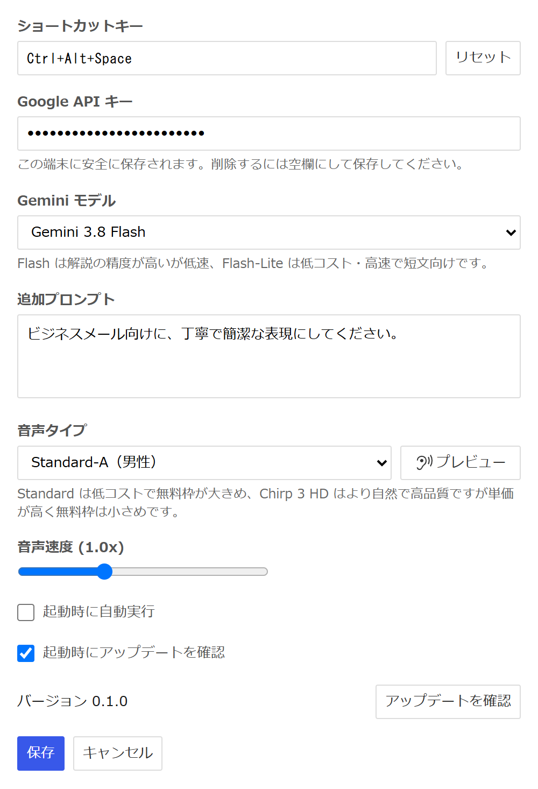
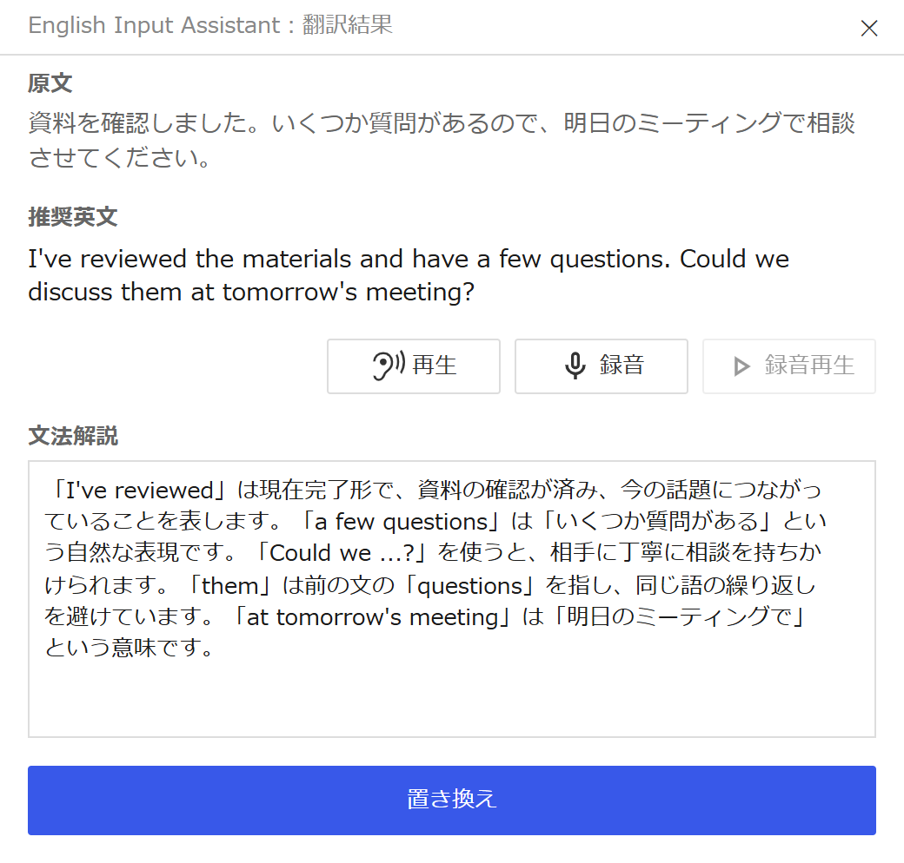

# English Input Assistant

英文入力を支援する Windows / macOS 向けデスクトップアプリです。選択した日本語または英語を、解説付きで自然な英文に変換します。ブラウザ内のテキストエリアだけでなく、デスクトップ上でテキストをコピー＆ペーストできる場所であればどこでも動作します。

<table>
  <tr>
    <th width="50%">設定</th>
    <th width="50%">翻訳結果</th>
  </tr>
  <tr>
    <td valign="top"></td>
    <td valign="top"></td>
  </tr>
</table>

## インストール / ダウンロード

[GitHub Releases](https://github.com/t-hamano/english-input-assistant/releases) から最新版を入手してください。

- Windows: `.exe`（インストーラ形式）
- macOS: `.dmg`（Apple Silicon 専用）

いずれもコード署名をしていないため、初回起動時に OS の警告が表示されます。

- Windows: SmartScreen の画面で「詳細情報」→「実行」を選択します。
- macOS: アプリを右クリックして「開く」を選択します。開けない場合はターミナルで `xattr -dr com.apple.quarantine "/Applications/English Input Assistant.app"` を実行します。

インストール版は、以降のバージョンを GitHub Releases から自動で取得・更新します。

## 動作環境

- Windows 10 / 11（64bit）
- Apple Silicon 搭載の Mac（Intel Mac は非対応）
- 翻訳・読み上げに使用するため、インターネット接続と Google の API キーが必要です（[「API キー」](#api-キー)を参照）。

## 使い方

- 起動するとタスクトレイ（macOS はメニューバー）に常駐します。設定画面と終了はそのアイコンから開きます。
- 初回はアプリの設定画面で [API キー](#api-キー)を登録してください。
- テキストを選択してキーボードショートカットを押すと変換が実行されます。デフォルトは Windows が <kbd>Ctrl</kbd>+<kbd>Alt</kbd>+<kbd>Space</kbd>、macOS が <kbd>Ctrl</kbd>+<kbd>Shift</kbd>+<kbd>Space</kbd> で、設定画面から変更できます。
- 変換結果のポップアップで「置き換え」を押すと、選択していた範囲が英文に差し替わります。置き換えずに閉じると元のテキストが復元されます。
- 提案された英文を読み上げる音声が 18 種類用意されています（低コストの Standard 10 種と、高品質な Chirp 3: HD 8 種）。英文読み上げの練習のために、自分の声を録音して聞き返すこともできます。

## API キー

このアプリは翻訳に Google Gemini、音声読み上げに Google Cloud Text-to-Speech を利用します。どちらも Google の API キー 1 つで動作します。

> [!IMPORTANT]
> API の利用量に応じて Google から課金される場合があります。各サービスの無料枠を超えると料金が発生します。Google Cloud Console で予算アラートや割り当て上限を設定し、利用量を定期的に確認してください。想定外の課金について作者は責任を負いません。
>
> 料金の詳細: [Gemini API の料金](https://ai.google.dev/gemini-api/docs/pricing?hl=ja) / [Text-to-Speech の料金](https://cloud.google.com/text-to-speech/pricing?hl=ja)

1. [Google AI Studio](https://aistudio.google.com/apikey) で API キーを発行します。
2. アプリの設定画面を開き、「Google API キー」欄に貼り付けて保存します。

入力したキーは OS の資格情報ストア（Windows: 資格情報マネージャー、macOS: キーチェーン）に保存されます。設定画面で欄を空にして保存すると削除されます。

### 音声読み上げを使う場合

読み上げは Google Cloud Text-to-Speech API を呼び出します。これは Gemini とは別サービスで、キーに紐づく Google Cloud プロジェクトで有効化が必要です。

1. [Google Cloud Console](https://console.cloud.google.com) で、API キーに紐づくプロジェクトを開きます（AI Studio でキー発行時に新規作成した場合はそのプロジェクト）。
2. 「Cloud Text-to-Speech API」を有効化します。
3. プロジェクトで課金を有効化します（無料枠の範囲・単価は料金ページを参照）。
4. API キーに制限を設定している場合は、Cloud Text-to-Speech API を許可リストに追加します。

有効化せずに読み上げを実行すると `Google TTS API エラー: HTTP 403` が表示されます。翻訳のみ利用する場合はこの手順は不要です。

## プライバシー / データの扱い

- 選択したテキストは翻訳のため Google の Generative Language API へ送信されます。読み上げを使う場合は、変換後の英文が Google Cloud Text-to-Speech API へ送信されます。
- API キーは OS の資格情報ストア（Windows: 資格情報マネージャー、macOS: キーチェーン）に保存されます。設定ファイルには書き込まれません。
- 変換結果・生成された音声・録音した自分の声はディスクに保存されません。音声はプロセス内メモリにのみ一時保持され、録音はアプリ内で再生されるだけです。
- Google の API と、アップデート確認のための GitHub 以外に、データを送信しません。

## ライセンス

[GNU General Public License v2.0 以降](LICENSE)（GPL-2.0-or-later）で配布します。
